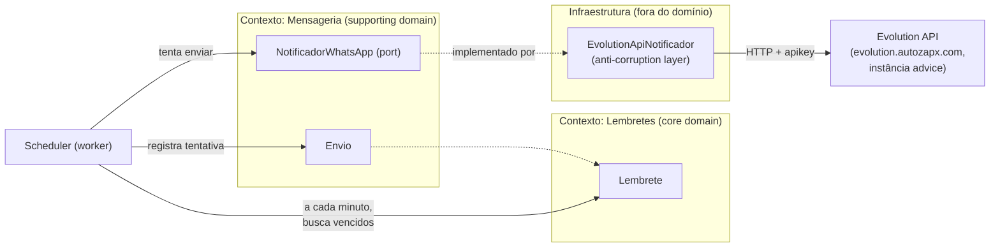
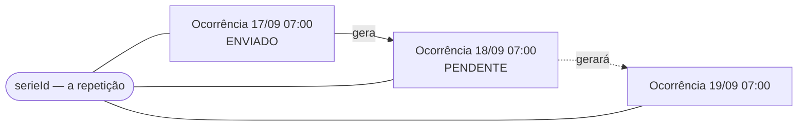
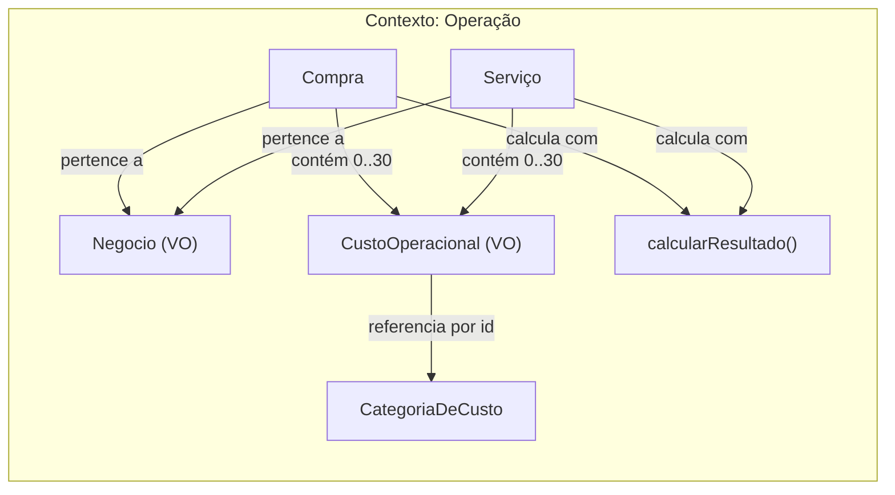

# Domínio

Dois contextos vivem neste sistema: **Lembretes** (avisos por WhatsApp) e
**Operação** (compras, custos e margem da Venturax). São independentes —
não compartilham aggregate, tabela nem regra; compartilham só o app.

Este documento é a modelagem DDD do projeto. É o contrato de linguagem entre
o produto e o código: todo nome usado aqui deve ser o mesmo nome usado nas
classes, tabelas e commits.

## Visão geral

O sistema agenda avisos (Lembretes) para uma data/hora específica e os
envia como mensagem de WhatsApp através da instância "advice" (Evolution
API, autenticação via API key global). É de uso pessoal: um único destinatário fixo, sem multi-tenant, sem
autenticação de usuários — a superfície de risco relevante é a Evolution
API (uma credencial, um número), não um sistema multiusuário.

## Bounded Contexts



- **Lembretes** — core domain. É o motivo do produto existir: guardar a
  intenção ("me avise disso, nesse dia, nessa hora") e seu ciclo de vida.
- **Mensageria** — supporting domain. Não é o motivo do produto existir,
  mas é necessário para cumprir a intenção. Isola completamente os
  detalhes de "como" a mensagem sai (hoje: Evolution API/WhatsApp).

A fronteira entre os dois é a porta `NotificadorWhatsApp` — o contexto de
Lembretes nunca soube, e nunca vai saber, que existe uma "Evolution API",
uma instância específica ou uma "apikey". Isso vive só na implementação
concreta (`EvolutionApiNotificador`), que é a **anti-corruption layer**
contra o provedor externo. Se a instância for trocada por outra,
outro provedor de WhatsApp, ou até outro canal (SMS, e-mail), só essa
implementação muda — nada no domínio ou na aplicação percebe.

## Ubiquitous language

| Termo | Significado |
|---|---|
| **Lembrete** | A intenção de ser avisado de algo, numa data/hora específica. Aggregate root do contexto de Lembretes. |
| **Agendamento** (`AgendamentoInfo`) | Value object: o instante (absoluto) para o qual um Lembrete está marcado, mais o timezone de referência para exibição. |
| **Envio** | Uma tentativa de entrega de um Lembrete via WhatsApp — sucesso ou falha. Aggregate próprio, referenciando o Lembrete por id. |
| **Notificador** | Porta de saída que sabe "enviar uma mensagem de WhatsApp". Não sabe nada sobre HTTP, apikey ou instância — isso é decisão da implementação. |
| **Status do Lembrete** | `PENDENTE` (único estado não-terminal) → `ENVIADO` \| `FALHOU` \| `CANCELADO` (terminais). |
| **Recorrência** | Value object: a regra que diz quando um Lembrete se repete — frequência (`DIARIA` \| `SEMANAL` \| `MENSAL`), hora/minuto de relógio de parede, e os dias que a frequência exige. |
| **Ocorrência** | Um Lembrete concreto de uma série recorrente: id, histórico de Envios e status terminal próprios. |
| **Série** (`serieId`) | A identidade da repetição atravessando todas as suas ocorrências. Aponta para a primeira delas. |
| **Scheduler** | Processo (worker) que, a cada minuto, pergunta "quais Lembretes pendentes já venceram?" e aciona o envio. Não é um bounded context — é um mecanismo técnico que orquestra o caso de uso `ProcessarLembretesPendentes`. |

## Aggregate: Lembrete

Estado: `id`, `titulo`, `agendamento` (`AgendamentoInfo`), `status`, `criadoEm`.

**Invariantes:**
- Título não pode ser vazio nem exceder 200 caracteres.
- Não pode ser criado com agendamento no passado (`AgendamentoInfo.criar`
  rejeita na fronteira — o aggregate nunca chega a existir em estado
  inválido).
- `PENDENTE` é o único estado do qual se pode sair. Uma vez `ENVIADO`,
  `FALHOU` ou `CANCELADO`, a transição é definitiva — tentar mudar de
  novo lança `TransicaoInvalidaError`. Isso garante que um Lembrete nunca
  é reenviado por engano (idempotência de negócio) e que cancelar algo já
  enviado é impossível por construção, não por validação de UI.

**Eventos de domínio:** `LembreteCriado`, `LembreteCancelado`,
`LembreteEnviado`, `EnvioDeLembreteFalhou`. Hoje não têm consumidores
(nenhum event bus) — existem para deixar o vocabulário de mudanças de
estado explícito e para o dia em que houver necessidade real de reagir a
eles (ex: log estruturado, notificação secundária). Não construído antes
da hora: `extrairEventos()` existe, publicá-los não.

## Aggregate: Envio

Estado: `id`, `lembreteId`, `tentativa`, `status` (`SUCESSO` \| `FALHA`),
`mensagemProviderId`, `erro`, `executadoEm`.

Por que é um aggregate separado do Lembrete, e não uma lista dentro dele:
o histórico de tentativas cresce sem limite e não faz parte do invariante
do Lembrete — para o Lembrete, só importa o resultado final. Colocar isso
dentro do aggregate root infligiria carregar histórico irrelevante toda
vez que o Lembrete é lido, e violaria a regra de um aggregate por
transação de consistência (o registro de uma tentativa e a atualização do
status do Lembrete são duas escritas relacionadas, não uma únicas).

## Caso de uso central: ProcessarLembretesPendentes

Executado pelo scheduler a cada minuto (`node-cron`, `noOverlap: true` —
nunca duas execuções simultâneas se um ciclo demorar mais que um minuto):

1. Busca todos os Lembretes `PENDENTE` cujo `agendadoPara` já passou.
2. Para cada um, chama `NotificadorWhatsApp.enviar`.
3. Sucesso → registra `Envio` de sucesso, marca o Lembrete `ENVIADO`.
4. Falha → registra `Envio` de falha. Se já é a 3ª tentativa
   (`MAX_TENTATIVAS`), marca o Lembrete `FALHOU` (terminal — some da fila
   de pendentes, fica visível no histórico da UI). Se ainda não esgotou
   as tentativas, o Lembrete **continua `PENDENTE`** e será retentado no
   próximo ciclo (1 minuto depois) — não existe backoff exponencial
   porque a granularidade do scheduler (1 min) já é o próprio backoff, e
   adicionar um mecanismo de delay maior seria complexidade sem
   propósito real neste volume de uso pessoal.

## Recorrência: uma série de ocorrências

“Todo dia às 07:00” não é um Lembrete que reabre — é uma **série**. Cada
disparo é uma ocorrência própria, com id, histórico de Envios e estado
terminal próprios; ao terminar, ela materializa a seguinte.



### Por que assim, e não um `agendadoPara` que avança

Reabrir a mesma linha exigiria afrouxar a invariante mais valiosa do
aggregate: *status terminal é definitivo*. É ela que garante, por
construção e não por validação, que nada é enviado duas vezes. Trocar
essa garantia por um campo mutável seria pagar com a única coisa que o
modelo tem de realmente sólido — e ainda perder o histórico: com série,
dá para ver que a repetição disparou ontem e falhou anteontem.

### As três consequências que definem o comportamento

1. **No máximo uma ocorrência `PENDENTE` por série.** A próxima só nasce
   quando a atual termina — não existe fila de ocorrências futuras
   acumulando no banco.
2. **Cancelar encerra a repetição.** Não há uma operação "cancelar
   série" separada: sem ocorrência pendente, não há quem gere a próxima.
   A regra vive no aggregate (`gerarProximaOcorrencia` devolve `null` a
   partir de `CANCELADO`), não numa checagem de UI.
3. **Falha definitiva continua a série.** `FALHOU` também gera sucessor:
   a Evolution API fora do ar numa manhã não pode matar em silêncio o
   lembrete diário. Só a decisão explícita do fundador encerra a
   repetição.

### Relógio de parede, não intervalo

A regra guarda hora e minuto (`07:00`), não um período de 24 horas, e a
próxima ocorrência é calculada **sempre a partir de "agora"**, nunca de
"anterior + 1 dia". Duas propriedades caem de graça disso:

- O horário sobrevive a virada de horário de verão. Somar 24h faria
  "às 07:00" virar "às 06:00" para sempre, sem ninguém perceber.
- O worker pode ficar dias fora do ar: a ocorrência vencida dispara uma
  vez e a próxima é amanhã — não uma enxurrada de avisos atrasados.

A aritmética de calendário em timezone vive em
`packages/domain/src/lembrete/tempo.ts`, sobre `Intl` (o banco IANA que
já vem no runtime), sem dependência externa. Dia 31 numa recorrência
mensal cai no último dia dos meses curtos — a intenção "todo fim de mês"
é preservada em vez de o lembrete sumir em fevereiro.

### Idempotência da materialização

Não há transação cobrindo "marcar como enviado" e "criar a próxima" — o
repositório é por aggregate, de propósito. A escolha foi gravar o
sucessor **primeiro**: uma queda entre as duas escritas faz o ciclo
seguinte reenviar a ocorrência atual (uma mensagem repetida, visível e
corrigível) em vez de deixar a série sem sucessor (o lembrete diário
que nunca mais chega, em silêncio).

Para que a regravação não duplique nada, o id da ocorrência é
**determinístico**: UUID v5 sobre (série, instante agendado). Recriar o
mesmo sucessor grava por cima de si mesmo. O índice único parcial em
`(serie_id, agendado_para)` é a garantia estrutural por trás disso.

## Por que não modelado (decisões conscientes de escopo v1)

- **Múltiplos destinatários/contatos**: fora de escopo. O destinatário é
  uma constante de configuração (`WHATSAPP_DESTINO`), não uma entidade —
  decisão confirmada com o fundador: os lembretes são sempre para o mesmo
  número.
- **Timezone dinâmico por usuário**: fora de escopo — uso pessoal,
  timezone fixo (`America/Sao_Paulo`), configurado como `TZ` dos
  containers Docker. `AgendamentoInfo` guarda o timezone só para exibição
  futura; toda comparação com "agora" usa o instante absoluto.

---

# Domínio — Operação

Segundo bounded context do sistema, sem nenhum acoplamento com
Lembretes: aggregates próprios, tabelas próprias, linguagem própria.
Responde a uma pergunta só, e responde bem: **quanto sobra de verdade**.

Desde 2026-09-17 o contexto atende **dois negócios** do fundador —
Fabio Junior Decor (papel de parede: venda do material e serviço de
aplicação) e Venturax (revenda em marketplace). Ver "Negócio: uma
dimensão, não dois sistemas".

## Por que é um contexto separado

"Lembrete" e "Compra" não compartilham um único conceito. Não há regra,
invariante ou tabela em comum — o que há em comum é o app que hospeda os
dois. Fundi-los num contexto só produziria um modelo que não significa
nada ("Item"?), e separá-los custa exatamente uma pasta.

## Visão geral



## Ubiquitous language

| Termo | Significado |
|---|---|
| **Negócio** | A qual das duas operações do fundador um lançamento pertence: `FABIOJUNIORDECOR` \| `VENTURAX`. Value object. |
| **Compra** | Um lote de mercadoria adquirido para revenda, com quantidade, custo unitário, preço de venda planejado e os custos que incidem sobre ele. Aggregate root. |
| **Serviço** | Um trabalho prestado e recebido — hoje, venda e instalação de papel de parede. Aggregate root. |
| **CustoOperacional** | Uma linha de custo dentro de uma Compra ou Serviço: categoria + modo de incidência + valor. Value object. |
| **CategoriaDeCusto** | Um tipo de custo reutilizável ("Frete", "Taxa Amazon", ou qualquer um criado pelo fundador). Aggregate root próprio. |
| **Modo de incidência** | `VALOR_FIXO` (uma vez no lote) \| `POR_UNIDADE` (× quantidade) \| `PERCENTUAL_DA_VENDA` (% da receita). |
| **Dinheiro** | Value object de centavos inteiros. Nunca float, nunca negativo. |
| **Percentual** | Value object de pontos-base inteiros (15% = `1500`). |
| **Receita bruta** | Preço de venda × quantidade (Compra) ou valor recebido (Serviço). |
| **Lucro bruto** | Receita − custo da mercadoria. Não desconta custo de operação. |
| **Lucro líquido** | Receita − custo da mercadoria − custos de operação. O número que decide. |
| **Ponto de equilíbrio** | Preço mínimo que zera a operação, e quantas unidades cobrem os custos fixos do lote. |

## Negócio: uma dimensão, não dois sistemas

O fundador toca duas operações com economias diferentes. O papel de
parede vende poucas unidades caras e leva mão de obra junto; o
marketplace vende muitas unidades baratas e paga percentual à
plataforma. **Margem média entre as duas não é a margem de nenhuma
delas** — por isso os painéis são separados.

O que *não* mudou: as regras. `calcularResultado()` é a mesma função,
`Dinheiro` é o mesmo centavo inteiro, e as categorias de custo são
compartilhadas — "Frete" é frete nos dois, e é isso que permite
comparar para onde o custo vai em cada um.

Por isso o negócio é uma **coluna**, não uma segunda instalação do app
nem um segundo par de tabelas. Duas tabelas de compras seriam duas
cópias de toda invariante de dinheiro e dois caminhos para a margem
divergir — exatamente o número pelo qual este contexto existe.

Consequências que valem registrar:

- `negocio` é NOT NULL, com CHECK no banco e revalidação no aggregate
  (`Compra.validar` / `Servico.validar`). Um lançamento sem dono
  entraria em silêncio nos dois painéis e estragaria os dois números.
- **É editável.** Lançar no negócio errado é o engano mais fácil de
  cometer, e sem o campo no formulário a única correção seria apagar e
  redigitar. Mudar o negócio move o lançamento de painel — e o editor
  devolve o fundador ao painel onde o lançamento *ficou*, não ao de
  onde ele entrou.
- **A visão geral não soma os dois.** Mostra um cartão por negócio,
  lado a lado, sem linha de total. Somar receita projetada de
  marketplace com recebido de aplicação produziria um número que não é
  caixa nem projeção de ninguém.
- **Nada impede a Venturax de ter serviço.** Que ela não tenha hoje é
  fato do negócio, não invariante do domínio: vive em `PERFIS`
  (`apps/web/src/lib/negocios.ts`), na camada de apresentação. O dia em
  que vender um serviço, é uma linha trocada — não uma migration. E a
  seção de serviços some do painel *só* se de fato não houver serviço
  registrado: esconder a seção esconderia dinheiro que existe.

## A decisão central: modo de incidência

É a modelagem que separa esta ferramenta de uma planilha ingênua. Um
frete de R$ 40, uma etiquetagem de R$ 0,80 por peça e uma taxa de 15%
da Amazon são **três matemáticas diferentes**:

- `VALOR_FIXO` entra uma vez, independentemente da quantidade.
- `POR_UNIDADE` multiplica pela quantidade.
- `PERCENTUAL_DA_VENDA` escala com o preço — sobe quando o preço sobe.

Tratar os três como "um valor" daria uma margem errada, que é exatamente
o número pelo qual o produto existe. E é essa separação que torna o
ponto de equilíbrio calculável em forma fechada:

```
preço mínimo = (CMV + fixos + porUnidade × q) / (q × (1 − Σ percentuais))
```

Quando os percentuais somam 100% ou mais, nenhum preço fecha a conta e o
domínio devolve `null` em vez de um número inventado.

## Aggregate: Compra

Estado: `id`, `negocio`, `descricao`, `quantidade`, `custoUnitario` (`Dinheiro`),
`precoVendaUnitario` (`Dinheiro`), `custos` (`CustoOperacional[]`),
`compradoEm`, `observacao`, `criadoEm`, `atualizadoEm`.

**Invariantes:** pertence a um negócio conhecido; descrição não vazia (≤ 200); quantidade inteira de 1 a
1.000.000; valores monetários são `Dinheiro` (inteiro de centavos,
não-negativo); até 30 linhas de custo; data válida.

A unidade de análise é o **lote**, não o produto: é assim que o dinheiro
sai (compram-se 50 peças, paga-se um frete) e é assim que a margem faz
sentido. O preço de venda é uma **projeção** — a operação existe para
responder "a esse preço, quanto sobra?" *antes* de comprar.

## Aggregate: Serviço

Estado: `id`, `negocio`, `descricao`, `cliente`, `valorRecebido` (`Dinheiro`),
`custos`, `recebidoEm`, `observacao`, `criadoEm`, `atualizadoEm`.

Diferente da Compra, a receita aqui é **realizada** — o dinheiro já
entrou. Por isso não há quantidade nem preço projetado.

**Invariante própria:** custo `POR_UNIDADE` é rejeitado. Serviço é um
trabalho, não um lote; aceitar esse modo produziria um número sem
significado. O banco replica a regra num CHECK em `custos_servico`.

O cálculo reusa `calcularResultado` com quantidade 1 e CMV zero — é o
que permite somar mercadoria e serviço no mesmo resumo sem inventar dois
conceitos de "margem".

## Aggregate: CategoriaDeCusto

Estado: `id`, `nome`, `modoPadrao`, `valorPadrao`, `arquivada`, `criadoEm`.

É entidade (e não texto livre em cada linha de custo) por um motivo
concreto: só assim dá para responder "quanto a Amazon levou no
trimestre?". Texto livre vira "Frete", "frete" e "Frete SP" como três
coisas — por isso o índice único é sobre `lower(nome)`.

`modoPadrao`/`valorPadrao` são **sugestões** que o formulário aplica ao
escolher a categoria (marcar "Taxa Amazon" já preenche 15% da venda). O
valor efetivo pertence a cada operação: mudar o padrão não reescreve
histórico.

**Nunca é excluída, só arquivada** — há operações apontando para ela, e
o histórico financeiro não pode perder o rótulo do que foi gasto. O FK é
`ON DELETE RESTRICT` para que isso não dependa de disciplina.

## Projeção × realização

O resumo separa deliberadamente:

- **Mercadoria** — receita **projetada**. Ainda não vendeu.
- **Serviços** — receita **realizada**. O dinheiro entrou.
- **Consolidado** — a soma, rotulada como projeção.

Somar os dois sem dizer isso seria mentir num painel financeiro. A UI
carrega o aviso; o DTO carrega a separação.

Margem consolidada é `lucro somado ÷ receita somada` — nunca a média das
margens, que daria peso igual a uma operação de R$ 50 e a uma de R$ 5.000.

## Por que não modelado (decisões conscientes de escopo v1)

- **Venda parcial de um lote** (vendi 12 das 50): fora de escopo. Hoje a
  Compra projeta o lote inteiro. Entra depois como registro de venda
  ligado à Compra, sem reescrever o aggregate.
- **Estoque como conceito próprio**: `unidadesEmEstoque` no resumo é a
  soma das quantidades compradas no período, não um saldo — não há baixa.
- **Fluxo de caixa / datas de pagamento**: o sistema mede margem, não
  caixa. Parcelamento e vencimento não são modelados.
- **Moeda que não seja BRL**: `Dinheiro` não carrega moeda. Um único
  operador, um único país.
- **Rateio de custo entre operações**: cada custo pertence a uma
  operação. Custo fixo do negócio (aluguel, contador) não é modelado.
- **Negócio como entidade** (com CNPJ, endereço, logo): são dois, fixos,
  do mesmo dono. Um enum descreve isso sem inventar um cadastro que
  ninguém vai manter. Vira entidade no dia em que um terceiro negócio
  aparecer com dados próprios — e aí a coluna já existe.
- **Categoria de custo por negócio**: hoje a lista é compartilhada de
  propósito, para os dois painéis falarem a mesma língua. Se um dia
  poluir, a saída é marcar visibilidade por negócio, não duplicar a
  tabela.

---

# Domínio — Hábitos

Terceiro contexto do app, desde 2026-09-17. Registra hábitos pessoais, o
que foi cumprido ou quebrado em cada dia, e o que passou pela cabeça na
hora de quebrar.

## Por que é um contexto separado

Não compartilha aggregate, invariante nem vocabulário com Lembretes ou
Operação. Um Lembrete é uma intenção de ser avisado num instante; um
Hábito é uma intenção que se repete indefinidamente e cuja unidade de
verdade é o **dia civil**, não o instante. Nenhuma regra de um serve ao
outro — e a única coisa de fato compartilhada, aritmética de calendário
(`lembrete/tempo.ts`), é reusada em vez de duplicada, justamente para
não existirem dois calendários.

## Visão geral

```
Habito (aggregate root)
  ├── HabitoId
  ├── nome, motivacao
  ├── Cadencia (value object: como se repete)
  └── arquivado

RegistroDeHabito (aggregate próprio)
  ├── RegistroDeHabitoId
  ├── HabitoId (referência)
  ├── DiaCivil (value object: o dia, sem hora e sem fuso)
  ├── SituacaoDoDia: FEITO | QUEBRADO
  └── observacao (o que aconteceu), pensamento (o que passou pela cabeça)
```

`RegistroDeHabito` é aggregate próprio, não filho de `Habito` — mesma
razão de `Envio` não viver dentro de `Lembrete`: um hábito diário produz
365 registros por ano, e carregar todos para ler o nome do hábito seria
uma regressão garantida de performance com o tempo.

## Ubiquitous language

- **Hábito**: a intenção que se repete. Aggregate root.
- **Registro**: o que foi declarado sobre um hábito num dia. Aggregate próprio.
- **Cadência**: a regra de repetição — `DIARIA` | `DIAS_DA_SEMANA` | `VEZES_POR_SEMANA`. Value object.
- **Dia civil**: um dia do calendário (`2026-09-17`), sem hora e sem fuso. Value object.
- **Situação do dia**: `FEITO` | `QUEBRADO`. Não existe "pulado".
- **Sequência**: dias (ou semanas) seguidos cumpridos e declarados, terminando em hoje.
- **Aderência**: cumpridos ÷ cobrados numa janela.
- **Motivação**: o porquê do hábito, escrito uma vez e lido no momento de fraqueza.

## A decisão central: o dia é uma data, não um instante

`DiaCivil` existe porque "fiz hoje" é uma afirmação sobre o calendário.
Guardar isso como `timestamptz` faria o mesmo registro mudar de dia
conforme o fuso de quem lê — às 21h de São Paulo já é o dia seguinte em
UTC — e destruiria a invariante central do contexto: **um registro por
hábito por dia**. A coluna é `date`, o value object é `YYYY-MM-DD`, e o
fuso aparece uma única vez em `DiaCivil.hoje()`, no servidor. A tela
nunca calcula o próprio "hoje".

## Ausência de registro não é quebra

Quebrar é um ato declarado. Um fim de semana sem abrir o app não vira
falha no histórico, e não existe um estado `PULADO` — ele obrigaria a
distinguir "pulei de propósito" de "não abri o app", que ninguém sabe
responder depois. A consequência aceita: a sequência conta o que foi
cumprido **e declarado**; um dia cobrado sem registro a interrompe.
Tratar silêncio como acerto tornaria o número uma cortesia.

## As três cadências são três perguntas diferentes

- `DIARIA` cobra hoje.
- `DIAS_DA_SEMANA` cobra hoje se hoje for um dos dias escolhidos.
- `VEZES_POR_SEMANA` não cobra nenhum dia em particular — cobra a
  semana. Por isso `Cadencia.exigeDia()` responde `false` nela: dizer
  `true` transformaria "3× por semana" em sete cobranças diárias e
  quatro faltas falsas.

Daí decorre que a sequência de um hábito flexível se conta em **semanas**
que bateram a meta, e a aderência dele olha só semanas **fechadas** — a
semana corrente ainda está sendo jogada, e incluí-la puxaria o número
para baixo toda segunda-feira de manhã. `7× por semana` é normalizado
para `DIARIA` na criação: são o mesmo hábito, e manter os dois contaria
sequência de duas formas.

## `calcularDesempenho()` é a única fonte da sequência e da aderência

Roda nos dois lados (servidor e browser), como `calcularResultado()` na
Operação. Nunca reimplementar em SQL, na UI ou num relatório — o número
tem de ser sempre o mesmo. Dois detalhes que só aparecem sob teste:

- **Hoje só conta contra depois de declarado.** Enquanto o dia não
  acabou não há falha a registrar: a sequência de ontem continua de pé e
  hoje não entra entre os devidos.
- **`desde` (a criação do hábito) limita a aderência, não a sequência.**
  Quem cria o hábito hoje e preenche os três dias anteriores cumpriu
  três dias — mas esses dias não entram como "cobrados", senão o hábito
  nasceria com aderência baixa por um motivo que não é comportamento.

## Arquivar e apagar são dois verbos

Arquivar tira da agenda preservando tudo: os registros continuam
apontando para o hábito, o histórico não perde o nome do que foi feito, e
o nome volta a ficar livre para um hábito novo. Apagar é irreversível e
leva os registros junto — existe para o hábito criado por engano. Mesma
regra de Lembretes; nenhum dos dois se disfarça do outro na tela.

## Por que não modelado (decisões conscientes de escopo v1)

- **Lembrete automático do hábito no WhatsApp**: os dois contextos
  dividem o app, não regras. Ligar um no outro é fácil depois (um
  Lembrete recorrente com o nome do hábito) e não muda nenhum aggregate.
- **Meta quantitativa** ("ler 30 páginas", "correr 5km"): hoje o dia é
  binário. Número por dia entra como campo do Registro, sem mexer na
  cadência.
- **Hábito de não fazer** ("não comer açúcar"): já funciona como está —
  `FEITO` significa "cumpri". O que falta é vocabulário na tela, não modelo.
- **Lembrar do horário do hábito**: `Cadencia` é sobre dias, não horas.
  Hora é assunto de Lembrete, e duplicá-la aqui criaria dois agendadores.
- **Séries/estatística longa** (melhor sequência histórica, gráficos):
  a caminhada de sequência tem teto de 366 dias e o painel carrega 400.
  Passar disso pede uma projeção materializada, não uma consulta maior.
