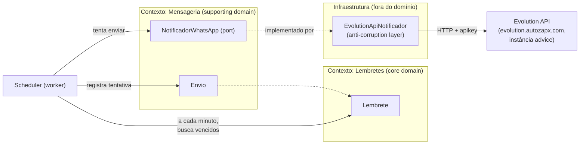

# Domínio — Lembretes via WhatsApp

Este documento é a modelagem DDD do projeto. É o contrato de linguagem entre
o produto e o código: todo nome usado aqui deve ser o mesmo nome usado nas
classes, tabelas e commits.

## Visão geral

O sistema agenda avisos (Lembretes) para uma data/hora específica e os
envia como mensagem de WhatsApp através da instância "advice" (Evolution
API, autenticação via API key global). É de uso pessoal: um único destinatário fixo, sem multi-tenant, sem
autenticação de usuários — a superfície de risco relevante é a Evolution
API (uma credencial, um número), não um sistema multiusuário.

## Bounded Contexts

- **Lembretes** — core domain. É o motivo do produto existir: guardar a
  intenção ("me avise disso, nesse dia, nessa hora") e seu ciclo de vida.
- **Mensageria** — supporting domain. Não é o motivo do produto existir,
  mas é necessário para cumprir a intenção. Isola completamente os
  detalhes de "como" a mensagem sai (hoje: Evolution API/WhatsApp).

A fronteira entre os dois é a porta `NotificadorWhatsApp` — o contexto de
Lembretes nunca soube, e nunca vai saber, que existe uma "Evolution API",
uma instância específica ou uma "apikey". Isso vive só na implementação
concreta (`EvolutionApiNotificador`), que é a **anti-corruption layer**
contra o provedor externo. Se a instância for trocada por outra,
outro provedor de WhatsApp, ou até outro canal (SMS, e-mail), só essa
implementação muda — nada no domínio ou na aplicação percebe.

## Ubiquitous language

| Termo | Significado |
|---|---|
| **Lembrete** | A intenção de ser avisado de algo, numa data/hora específica. Aggregate root do contexto de Lembretes. |
| **Agendamento** (`AgendamentoInfo`) | Value object: o instante (absoluto) para o qual um Lembrete está marcado, mais o timezone de referência para exibição. |
| **Envio** | Uma tentativa de entrega de um Lembrete via WhatsApp — sucesso ou falha. Aggregate próprio, referenciando o Lembrete por id. |
| **Notificador** | Porta de saída que sabe "enviar uma mensagem de WhatsApp". Não sabe nada sobre HTTP, apikey ou instância — isso é decisão da implementação. |
| **Status do Lembrete** | `PENDENTE` (único estado não-terminal) → `ENVIADO` \| `FALHOU` \| `CANCELADO` (terminais). |
| **Scheduler** | Processo (worker) que, a cada minuto, pergunta "quais Lembretes pendentes já venceram?" e aciona o envio. Não é um bounded context — é um mecanismo técnico que orquestra o caso de uso `ProcessarLembretesPendentes`. |

## Aggregate: Lembrete

Estado: `id`, `titulo`, `agendamento` (`AgendamentoInfo`), `status`, `criadoEm`.

**Invariantes:**
- Título não pode ser vazio nem exceder 200 caracteres.
- Não pode ser criado com agendamento no passado (`AgendamentoInfo.criar`
  rejeita na fronteira — o aggregate nunca chega a existir em estado
  inválido).
- `PENDENTE` é o único estado do qual se pode sair. Uma vez `ENVIADO`,
  `FALHOU` ou `CANCELADO`, a transição é definitiva — tentar mudar de
  novo lança `TransicaoInvalidaError`. Isso garante que um Lembrete nunca
  é reenviado por engano (idempotência de negócio) e que cancelar algo já
  enviado é impossível por construção, não por validação de UI.

**Eventos de domínio:** `LembreteCriado`, `LembreteCancelado`,
`LembreteEnviado`, `EnvioDeLembreteFalhou`. Hoje não têm consumidores
(nenhum event bus) — existem para deixar o vocabulário de mudanças de
estado explícito e para o dia em que houver necessidade real de reagir a
eles (ex: log estruturado, notificação secundária). Não construído antes
da hora: `extrairEventos()` existe, publicá-los não.

## Aggregate: Envio

Estado: `id`, `lembreteId`, `tentativa`, `status` (`SUCESSO` \| `FALHA`),
`mensagemProviderId`, `erro`, `executadoEm`.

Por que é um aggregate separado do Lembrete, e não uma lista dentro dele:
o histórico de tentativas cresce sem limite e não faz parte do invariante
do Lembrete — para o Lembrete, só importa o resultado final. Colocar isso
dentro do aggregate root infligiria carregar histórico irrelevante toda
vez que o Lembrete é lido, e violaria a regra de um aggregate por
transação de consistência (o registro de uma tentativa e a atualização do
status do Lembrete são duas escritas relacionadas, não uma únicas).

## Caso de uso central: ProcessarLembretesPendentes

Executado pelo scheduler a cada minuto (`node-cron`, `noOverlap: true` —
nunca duas execuções simultâneas se um ciclo demorar mais que um minuto):

1. Busca todos os Lembretes `PENDENTE` cujo `agendadoPara` já passou.
2. Para cada um, chama `NotificadorWhatsApp.enviar`.
3. Sucesso → registra `Envio` de sucesso, marca o Lembrete `ENVIADO`.
4. Falha → registra `Envio` de falha. Se já é a 3ª tentativa
   (`MAX_TENTATIVAS`), marca o Lembrete `FALHOU` (terminal — some da fila
   de pendentes, fica visível no histórico da UI). Se ainda não esgotou
   as tentativas, o Lembrete **continua `PENDENTE`** e será retentado no
   próximo ciclo (1 minuto depois) — não existe backoff exponencial
   porque a granularidade do scheduler (1 min) já é o próprio backoff, e
   adicionar um mecanismo de delay maior seria complexidade sem
   propósito real neste volume de uso pessoal.

## Por que não modelado (decisões conscientes de escopo v1)

- **Múltiplos destinatários/contatos**: fora de escopo. O destinatário é
  uma constante de configuração (`WHATSAPP_DESTINO`), não uma entidade —
  decisão confirmada com o fundador: os lembretes são sempre para o mesmo
  número.
- **Recorrência** (“todo dia às 8h”): fora de escopo da v1 — cada
  Lembrete tem uma única data/hora. Se entrar depois, é uma extensão
  aditiva (`RecorrenciaRule` como novo value object + um caso de uso que,
  ao marcar `ENVIADO`, cria o próximo Lembrete) — não exige reescrever o
  aggregate existente.
- **Timezone dinâmico por usuário**: fora de escopo — uso pessoal,
  timezone fixo (`America/Sao_Paulo`), configurado como `TZ` dos
  containers Docker. `AgendamentoInfo` guarda o timezone só para exibição
  futura; toda comparação com "agora" usa o instante absoluto.
