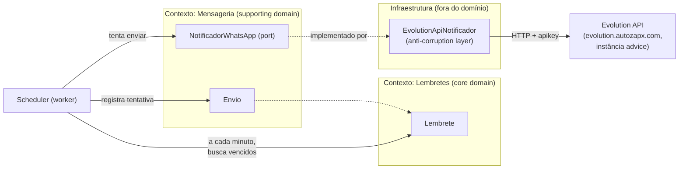
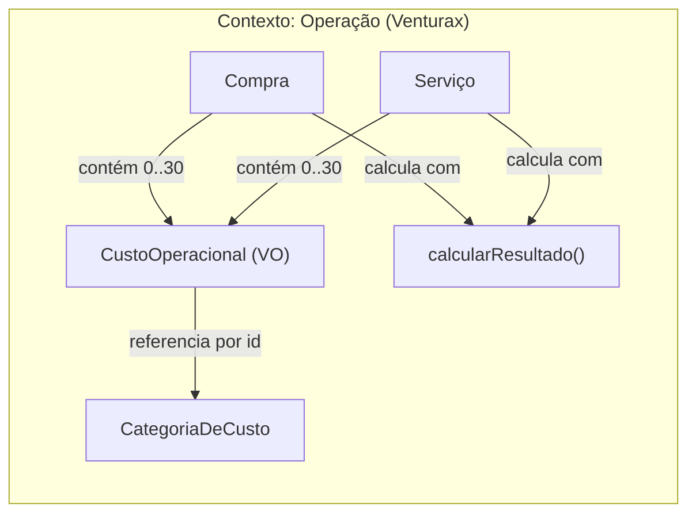

# Domínio

Dois contextos vivem neste sistema: **Lembretes** (avisos por WhatsApp) e
**Operação** (compras, custos e margem da Venturax). São independentes —
não compartilham aggregate, tabela nem regra; compartilham só o app.

Este documento é a modelagem DDD do projeto. É o contrato de linguagem entre
o produto e o código: todo nome usado aqui deve ser o mesmo nome usado nas
classes, tabelas e commits.

## Visão geral

O sistema agenda avisos (Lembretes) para uma data/hora específica e os
envia como mensagem de WhatsApp através da instância "advice" (Evolution
API, autenticação via API key global). É de uso pessoal: um único destinatário fixo, sem multi-tenant, sem
autenticação de usuários — a superfície de risco relevante é a Evolution
API (uma credencial, um número), não um sistema multiusuário.

## Bounded Contexts



- **Lembretes** — core domain. É o motivo do produto existir: guardar a
  intenção ("me avise disso, nesse dia, nessa hora") e seu ciclo de vida.
- **Mensageria** — supporting domain. Não é o motivo do produto existir,
  mas é necessário para cumprir a intenção. Isola completamente os
  detalhes de "como" a mensagem sai (hoje: Evolution API/WhatsApp).

A fronteira entre os dois é a porta `NotificadorWhatsApp` — o contexto de
Lembretes nunca soube, e nunca vai saber, que existe uma "Evolution API",
uma instância específica ou uma "apikey". Isso vive só na implementação
concreta (`EvolutionApiNotificador`), que é a **anti-corruption layer**
contra o provedor externo. Se a instância for trocada por outra,
outro provedor de WhatsApp, ou até outro canal (SMS, e-mail), só essa
implementação muda — nada no domínio ou na aplicação percebe.

## Ubiquitous language

| Termo | Significado |
|---|---|
| **Lembrete** | A intenção de ser avisado de algo, numa data/hora específica. Aggregate root do contexto de Lembretes. |
| **Agendamento** (`AgendamentoInfo`) | Value object: o instante (absoluto) para o qual um Lembrete está marcado, mais o timezone de referência para exibição. |
| **Envio** | Uma tentativa de entrega de um Lembrete via WhatsApp — sucesso ou falha. Aggregate próprio, referenciando o Lembrete por id. |
| **Notificador** | Porta de saída que sabe "enviar uma mensagem de WhatsApp". Não sabe nada sobre HTTP, apikey ou instância — isso é decisão da implementação. |
| **Status do Lembrete** | `PENDENTE` (único estado não-terminal) → `ENVIADO` \| `FALHOU` \| `CANCELADO` (terminais). |
| **Scheduler** | Processo (worker) que, a cada minuto, pergunta "quais Lembretes pendentes já venceram?" e aciona o envio. Não é um bounded context — é um mecanismo técnico que orquestra o caso de uso `ProcessarLembretesPendentes`. |

## Aggregate: Lembrete

Estado: `id`, `titulo`, `agendamento` (`AgendamentoInfo`), `status`, `criadoEm`.

**Invariantes:**
- Título não pode ser vazio nem exceder 200 caracteres.
- Não pode ser criado com agendamento no passado (`AgendamentoInfo.criar`
  rejeita na fronteira — o aggregate nunca chega a existir em estado
  inválido).
- `PENDENTE` é o único estado do qual se pode sair. Uma vez `ENVIADO`,
  `FALHOU` ou `CANCELADO`, a transição é definitiva — tentar mudar de
  novo lança `TransicaoInvalidaError`. Isso garante que um Lembrete nunca
  é reenviado por engano (idempotência de negócio) e que cancelar algo já
  enviado é impossível por construção, não por validação de UI.

**Eventos de domínio:** `LembreteCriado`, `LembreteCancelado`,
`LembreteEnviado`, `EnvioDeLembreteFalhou`. Hoje não têm consumidores
(nenhum event bus) — existem para deixar o vocabulário de mudanças de
estado explícito e para o dia em que houver necessidade real de reagir a
eles (ex: log estruturado, notificação secundária). Não construído antes
da hora: `extrairEventos()` existe, publicá-los não.

## Aggregate: Envio

Estado: `id`, `lembreteId`, `tentativa`, `status` (`SUCESSO` \| `FALHA`),
`mensagemProviderId`, `erro`, `executadoEm`.

Por que é um aggregate separado do Lembrete, e não uma lista dentro dele:
o histórico de tentativas cresce sem limite e não faz parte do invariante
do Lembrete — para o Lembrete, só importa o resultado final. Colocar isso
dentro do aggregate root infligiria carregar histórico irrelevante toda
vez que o Lembrete é lido, e violaria a regra de um aggregate por
transação de consistência (o registro de uma tentativa e a atualização do
status do Lembrete são duas escritas relacionadas, não uma únicas).

## Caso de uso central: ProcessarLembretesPendentes

Executado pelo scheduler a cada minuto (`node-cron`, `noOverlap: true` —
nunca duas execuções simultâneas se um ciclo demorar mais que um minuto):

1. Busca todos os Lembretes `PENDENTE` cujo `agendadoPara` já passou.
2. Para cada um, chama `NotificadorWhatsApp.enviar`.
3. Sucesso → registra `Envio` de sucesso, marca o Lembrete `ENVIADO`.
4. Falha → registra `Envio` de falha. Se já é a 3ª tentativa
   (`MAX_TENTATIVAS`), marca o Lembrete `FALHOU` (terminal — some da fila
   de pendentes, fica visível no histórico da UI). Se ainda não esgotou
   as tentativas, o Lembrete **continua `PENDENTE`** e será retentado no
   próximo ciclo (1 minuto depois) — não existe backoff exponencial
   porque a granularidade do scheduler (1 min) já é o próprio backoff, e
   adicionar um mecanismo de delay maior seria complexidade sem
   propósito real neste volume de uso pessoal.

## Por que não modelado (decisões conscientes de escopo v1)

- **Múltiplos destinatários/contatos**: fora de escopo. O destinatário é
  uma constante de configuração (`WHATSAPP_DESTINO`), não uma entidade —
  decisão confirmada com o fundador: os lembretes são sempre para o mesmo
  número.
- **Recorrência** (“todo dia às 8h”): fora de escopo da v1 — cada
  Lembrete tem uma única data/hora. Se entrar depois, é uma extensão
  aditiva (`RecorrenciaRule` como novo value object + um caso de uso que,
  ao marcar `ENVIADO`, cria o próximo Lembrete) — não exige reescrever o
  aggregate existente.
- **Timezone dinâmico por usuário**: fora de escopo — uso pessoal,
  timezone fixo (`America/Sao_Paulo`), configurado como `TZ` dos
  containers Docker. `AgendamentoInfo` guarda o timezone só para exibição
  futura; toda comparação com "agora" usa o instante absoluto.

---

# Domínio — Operação Venturax

Segundo bounded context do sistema, sem nenhum acoplamento com
Lembretes: aggregates próprios, tabelas próprias, linguagem própria.
Responde a uma pergunta só, e responde bem: **quanto sobra de verdade**.

## Por que é um contexto separado

"Lembrete" e "Compra" não compartilham um único conceito. Não há regra,
invariante ou tabela em comum — o que há em comum é o app que hospeda os
dois. Fundi-los num contexto só produziria um modelo que não significa
nada ("Item"?), e separá-los custa exatamente uma pasta.

## Visão geral



## Ubiquitous language

| Termo | Significado |
|---|---|
| **Compra** | Um lote de mercadoria adquirido para revenda, com quantidade, custo unitário, preço de venda planejado e os custos que incidem sobre ele. Aggregate root. |
| **Serviço** | Um trabalho prestado e recebido — hoje, venda e instalação de papel de parede. Aggregate root. |
| **CustoOperacional** | Uma linha de custo dentro de uma Compra ou Serviço: categoria + modo de incidência + valor. Value object. |
| **CategoriaDeCusto** | Um tipo de custo reutilizável ("Frete", "Taxa Amazon", ou qualquer um criado pelo fundador). Aggregate root próprio. |
| **Modo de incidência** | `VALOR_FIXO` (uma vez no lote) \| `POR_UNIDADE` (× quantidade) \| `PERCENTUAL_DA_VENDA` (% da receita). |
| **Dinheiro** | Value object de centavos inteiros. Nunca float, nunca negativo. |
| **Percentual** | Value object de pontos-base inteiros (15% = `1500`). |
| **Receita bruta** | Preço de venda × quantidade (Compra) ou valor recebido (Serviço). |
| **Lucro bruto** | Receita − custo da mercadoria. Não desconta custo de operação. |
| **Lucro líquido** | Receita − custo da mercadoria − custos de operação. O número que decide. |
| **Ponto de equilíbrio** | Preço mínimo que zera a operação, e quantas unidades cobrem os custos fixos do lote. |

## A decisão central: modo de incidência

É a modelagem que separa esta ferramenta de uma planilha ingênua. Um
frete de R$ 40, uma etiquetagem de R$ 0,80 por peça e uma taxa de 15%
da Amazon são **três matemáticas diferentes**:

- `VALOR_FIXO` entra uma vez, independentemente da quantidade.
- `POR_UNIDADE` multiplica pela quantidade.
- `PERCENTUAL_DA_VENDA` escala com o preço — sobe quando o preço sobe.

Tratar os três como "um valor" daria uma margem errada, que é exatamente
o número pelo qual o produto existe. E é essa separação que torna o
ponto de equilíbrio calculável em forma fechada:

```
preço mínimo = (CMV + fixos + porUnidade × q) / (q × (1 − Σ percentuais))
```

Quando os percentuais somam 100% ou mais, nenhum preço fecha a conta e o
domínio devolve `null` em vez de um número inventado.

## Aggregate: Compra

Estado: `id`, `descricao`, `quantidade`, `custoUnitario` (`Dinheiro`),
`precoVendaUnitario` (`Dinheiro`), `custos` (`CustoOperacional[]`),
`compradoEm`, `observacao`, `criadoEm`, `atualizadoEm`.

**Invariantes:** descrição não vazia (≤ 200); quantidade inteira de 1 a
1.000.000; valores monetários são `Dinheiro` (inteiro de centavos,
não-negativo); até 30 linhas de custo; data válida.

A unidade de análise é o **lote**, não o produto: é assim que o dinheiro
sai (compram-se 50 peças, paga-se um frete) e é assim que a margem faz
sentido. O preço de venda é uma **projeção** — a operação existe para
responder "a esse preço, quanto sobra?" *antes* de comprar.

## Aggregate: Serviço

Estado: `id`, `descricao`, `cliente`, `valorRecebido` (`Dinheiro`),
`custos`, `recebidoEm`, `observacao`, `criadoEm`, `atualizadoEm`.

Diferente da Compra, a receita aqui é **realizada** — o dinheiro já
entrou. Por isso não há quantidade nem preço projetado.

**Invariante própria:** custo `POR_UNIDADE` é rejeitado. Serviço é um
trabalho, não um lote; aceitar esse modo produziria um número sem
significado. O banco replica a regra num CHECK em `custos_servico`.

O cálculo reusa `calcularResultado` com quantidade 1 e CMV zero — é o
que permite somar mercadoria e serviço no mesmo resumo sem inventar dois
conceitos de "margem".

## Aggregate: CategoriaDeCusto

Estado: `id`, `nome`, `modoPadrao`, `valorPadrao`, `arquivada`, `criadoEm`.

É entidade (e não texto livre em cada linha de custo) por um motivo
concreto: só assim dá para responder "quanto a Amazon levou no
trimestre?". Texto livre vira "Frete", "frete" e "Frete SP" como três
coisas — por isso o índice único é sobre `lower(nome)`.

`modoPadrao`/`valorPadrao` são **sugestões** que o formulário aplica ao
escolher a categoria (marcar "Taxa Amazon" já preenche 15% da venda). O
valor efetivo pertence a cada operação: mudar o padrão não reescreve
histórico.

**Nunca é excluída, só arquivada** — há operações apontando para ela, e
o histórico financeiro não pode perder o rótulo do que foi gasto. O FK é
`ON DELETE RESTRICT` para que isso não dependa de disciplina.

## Projeção × realização

O resumo separa deliberadamente:

- **Mercadoria** — receita **projetada**. Ainda não vendeu.
- **Serviços** — receita **realizada**. O dinheiro entrou.
- **Consolidado** — a soma, rotulada como projeção.

Somar os dois sem dizer isso seria mentir num painel financeiro. A UI
carrega o aviso; o DTO carrega a separação.

Margem consolidada é `lucro somado ÷ receita somada` — nunca a média das
margens, que daria peso igual a uma operação de R$ 50 e a uma de R$ 5.000.

## Por que não modelado (decisões conscientes de escopo v1)

- **Venda parcial de um lote** (vendi 12 das 50): fora de escopo. Hoje a
  Compra projeta o lote inteiro. Entra depois como registro de venda
  ligado à Compra, sem reescrever o aggregate.
- **Estoque como conceito próprio**: `unidadesEmEstoque` no resumo é a
  soma das quantidades compradas no período, não um saldo — não há baixa.
- **Fluxo de caixa / datas de pagamento**: o sistema mede margem, não
  caixa. Parcelamento e vencimento não são modelados.
- **Moeda que não seja BRL**: `Dinheiro` não carrega moeda. Um único
  operador, um único país.
- **Rateio de custo entre operações**: cada custo pertence a uma
  operação. Custo fixo do negócio (aluguel, contador) não é modelado.
